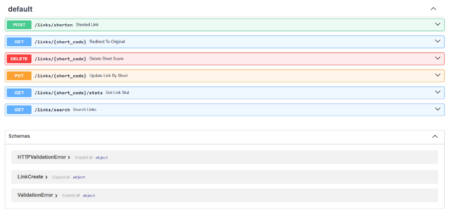
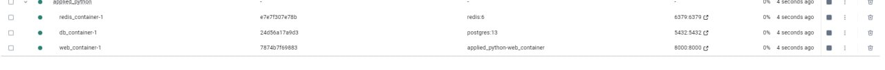

# Домашнее задание 3

## Описание API

1. **POST /links/shorten** — создает короткую ссылку.
2. **GET /links/{short_code}** — перенаправляет на оригинальный URL.
3. **DELETE /links/{short_code}** — удаляет короткую ссылку.
4. **PUT /links/{short_code}** — обновляет URL для короткой ссылки.
5. **GET /links/{short_code}/stats** — получает статистику по ссылке (количество переходов, дата создания и последнего использования).
6. **POST /links/shorten (с кастомным alias)** — создает короткую ссылку с уникальным alias.
7. **GET /links/search?original_url={url}** — ищет короткую ссылку по оригинальному URL.
8. **POST /links/shorten (с параметром expires_at)** — создает короткую ссылку с временем жизни.

## База данных

Используется **PostgreSQL** для хранения данных о ссылках и их статистике. Redis применяется для кэширования топ-100 популярных ссылок. Ссылки, не использовавшиеся более 90 дней, удаляются автоматически.

## Дополнительные функции

- Удаление неактивных ссылок.
- Кэширование популярных ссылок для улучшения производительности.

